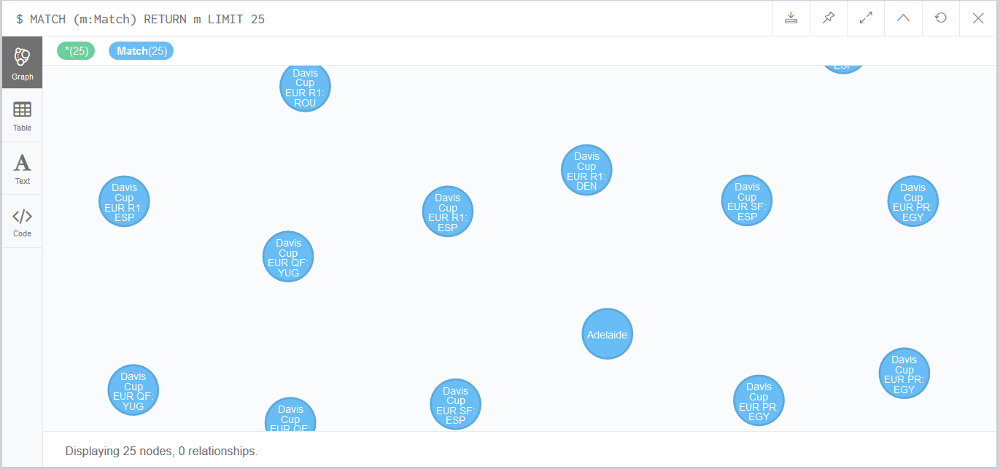
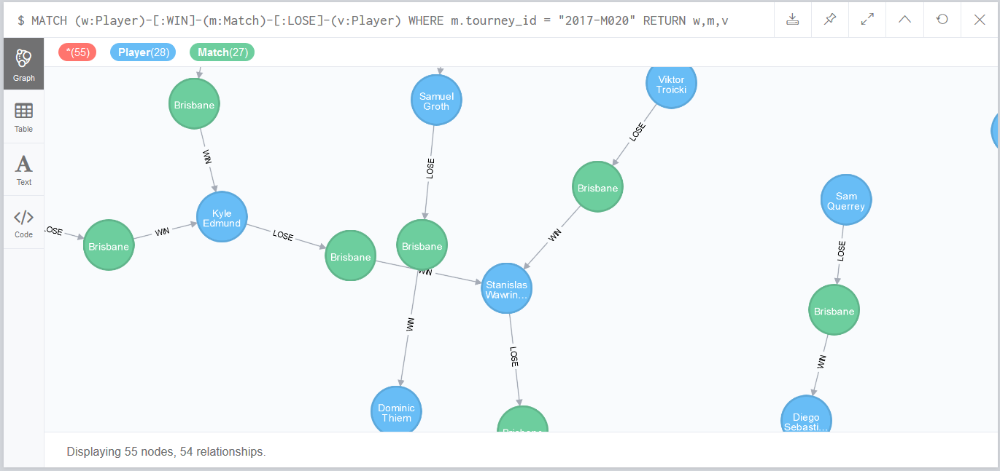

# README

## Criar a VM
Para criar a VM e instalar o neo4j, basta executar:
```
C:\cd ubuntu_18_04_jdk8_neo4j
C:\ubuntu_18_04_jdk8_neo4j\vagrant up
```

## Configurar neo4j

Apos criar a VM e instalar o neo4j, edite o arquivo `/etc/neo4j/neo4j.conf` para configurar o acesso externo e as portas utilizadas.

Descomente as seguintes linhas:

<pre><code>
# With default configuration Neo4j only accepts local connections.
# To accept non-local connections, uncomment this line:
<b>dbms.connectors.default_listen_address=0.0.0.0</b>

...

# Bolt connector
dbms.connector.bolt.enabled=true
#dbms.connector.bolt.tls_level=OPTIONAL
<b>dbms.connector.bolt.listen_address=:7687</b>

# HTTP Connector. There must be exactly one HTTP connector.
dbms.connector.http.enabled=true
<b>dbms.connector.http.listen_address=:7474</b>

# HTTPS Connector. There can be zero or one HTTPS connectors.
dbms.connector.https.enabled=true
<b>dbms.connector.https.listen_address=:7473</b>
</code></pre>


## Executar a VM

Para executar a VM utilize o comando:

    vagrant up

## Subir o servico do Neo4j

Pelo terminal, acessar a VM e utilizar o comando `service` para subir o servico do banco de dados Neo4j.

```
vagrant ssh
sudo service neo4j start
```
## Parar o servico do Neo4j

Pelo terminal, acessar a VM e utilizar o comando `service` para parar o servico do banco de dados Neo4j.

```
vagrant ssh
sudo service neo4j stop
```
## Verificar se o servico do Neo4j esta executando

Pelo terminal, acessar a VM e utilizar o comando:

```
vagrant ssh
service --status-all | grep neo4j
```
## Acessando o Neo4j pelo browser

Para acessar a aplicação web do Neo4j e interagir com o banco de dados, acesse o endereço http://localhost:7474/browser/.

Para se conectar ao banco de dados, utilize:

    :server connect

E, no formulario de login utilize:

* **Host**: `bolt://localhost:7687`
* **Username**: `neo4j`
* **Password**: `neo4j`

> Obs.: Na primeira vez que for feita a conexao com o usuario `neo4j`, sera pedido para modificar a senha.

## Carregando dados de arquivo CSV

Para carregar dados de um arquivo CSV e criar `nodes` utilize:

```
USING PERIODIC COMMIT
LOAD CSV WITH HEADERS FROM "https://raw.githubusercontent.com/stakah/tennis_atp/master/atp_matches_2017.csv" AS row
CREATE (n:Match)
SET n = row
```
Nesse exemplo, carrega dados dos matches da ATP do ano de 2017.

## Consultar `nodes` de um certo tipo

Para consultar os dados utilize o comando `MATCH` do Neo4j.

```
MATCH (m:Match) RETURN m LIMIT 25
```


## Criar Indices

Para criar indices

```
CREATE INDEX ON :Match(tourney_id)
CREATE INDEX ON :Match(winner_id)
CREATE INDEX ON :match(loser_id)
```

## Criar `node` derivado de um resultado de um `MATCH`

```
MATCH (m:Match)
WHERE date(m.tourney_date).year = 2017
MERGE (:Player {player_id:m.winner_id, name:m.winner_name})
```
O exemplo esta criando um conjunto de `nodes` do tipo `Player` a partir dos dados do ganhador dos `Matches` de 2017.

## Criar relacionamento entre `nodes`

```
MATCH (m:Match), (p:Player)
WHERE date(m.tourney_date).year = 2017
AND m.winner_id = p.player_id
MERGE (m)-[:WIN]->(p)
```
Este exemplo esta criando uma aresta (edge) direcionada para o `WINner` do `Match`.

```
MATCH (m:Match), (p:Player)
WHERE date(m.tourney_date).year = 2017
AND m.loser_id = p.player_id
MERGE (m)<-[:LOSE]-(p)
```
Este segundo exemplo cria o relacionamento entre o `Match` e o `LOSEr` do jogo.

## Consutar um grafo com `nodes` e `edges`

```
MATCH (w:Player)-[:WIN]-(m:Match)-[:LOSE]-(v:Player)
WHERE m.tourney_id = "2017-M020"
RETURN w,m,v
```
